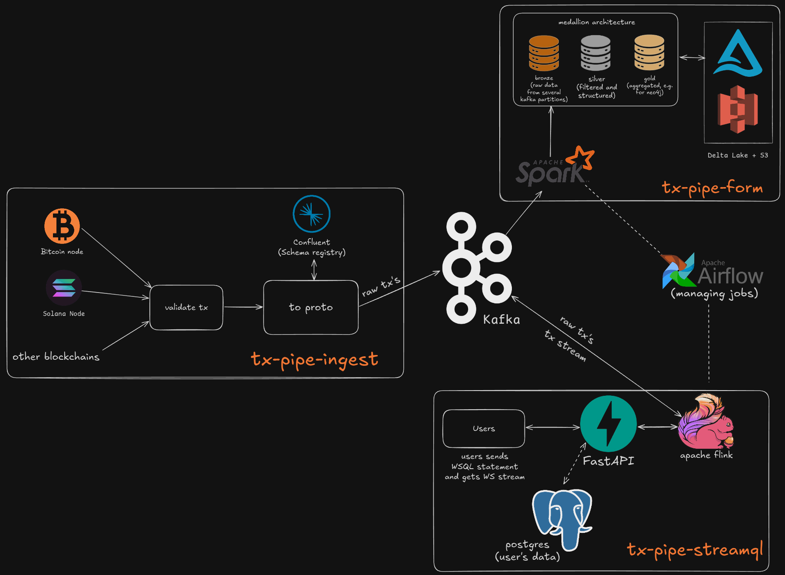
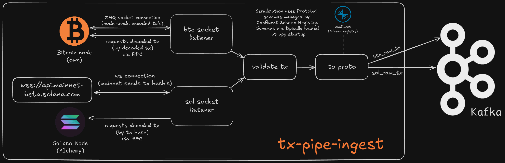

# TxPipe Ingest
**tx-pipe-ingest** - is one of the multiple components in the **tx-pipe** infrastructure. It **ingests** transactions from different blockchains, validates them, transforms into a protobuf format and publishes them to Kafka topics. In the future, **tx-pipe-ingest** will implement block-processing with a fail-safe mechanism to ensure that no transactions are missed and, if missed, the state is restored.

Simple representation of tx-pipe (data section) infrastructure:


---

And tx-pipe-ingest itself in detail:


---


## Getting Started

These instructions will get you a copy of the project up and running on your local machine for development and testing purposes, or show you how to build and run it using Docker.

### Prerequisites

*   Python >=3.12,<4.0 (as defined in `pyproject.toml`) *(For local dev)*
*   Poetry (>=1.2 for group dependency support) - [Installation Guide](https://python-poetry.org/docs/#installation) *(For local dev)*
*   Docker & Docker Compose (with BuildKit enabled, usually default in recent versions)
*   Access credentials for the target Confluent Schema Registry and blockchain nodes.

### Local Development Setup

1.  **Clone the repository:**
    ```bash
    git clone https://github.com/tx-pipe/tx-pipe-ingest.git
    cd tx-pipe-ingest
    ```

2.  **Configure Environment Variables:**
    
    This project requires credentials to access the Confluent Schema Registry for fetching Protobuf schemas (`example.env.build`) and creds to access several blockchain nodes and RPC's (`example.env`)
    *   Copy the example environment file: `cp example.env .env`
    *   Copy the .build example environment file `cp example.env.build .env.build`
    *   Fill empty variables with your data
    *   If you don't need to run the app locally you can the skip next steps and go to the "Docker Usage" section


3.  **Install Dependencies:**
    Use Poetry to install project dependencies, including development tools needed for code generation.
    ```bash
    poetry install --with dev --all-extras
    ```

4.  **Generate Protobuf Code:**
    The Python code corresponding to the Protobuf schemas is generated from the Schema Registry and is **not** committed to Git. You need to run the generation script after initial setup or whenever the upstream schemas change.
    ```bash
    poetry run poe generate-protos
    ```
    This command uses the configuration in your `.env.build` file to fetch schemas, download them into `tx_pipe_ingest/proto/` and generate Python files in `tx_pipe_ingest/generated/proto/`.

### Running Locally

Once dependencies are installed and Protobuf code is generated, you can run the application directly using:

```bash
# Replace <blockchain> with blockchain name, e.g. 'btc'
poetry run python main.py <blockchain>
```


## Docker Usage

The project includes a multi-stage `Dockerfile` optimized for production builds, including the Protobuf generation step using secure BuildKit secrets.

*Note: The following instructions use the `docker compose` (v2) command syntax. If you are using an older, standalone version of Docker Compose, replace `docker compose` with `docker-compose` (with a hyphen) in the commands below.*
1.  **Build the Docker Image:**
    Use Docker Compose to build the image for the desired blockchain variant. This method correctly handles passing the `.env.build` file as a build secret. Make sure your `.env.build` and `.env` files is configured as described in the Local Setup section.

      ```bash
    # Build the image for the BTC variant
    docker compose build tx-pipe-btc

    # Build the image for the SOL variant
    docker compose build tx-pipe-sol
    
    # Alternatively, build images for all defined services at once
    # docker compose build
    ```

2.  **Run the Docker Container:**
    
    Use Docker Compose to run the containers. They will use the corresponding images built in the previous step and manage runtime environment variables via the `.env` file.
   *   **Run a specific service:** Choose this if you only want to ingest data from one blockchain.
       ```bash
        # Run the BTC variant in detached mode
        docker compose up -d tx-pipe-btc

        # Run the SOL variant in detached mode
        docker compose up -d tx-pipe-sol
       ```

   *   **Run all services:** Choose this to run all defined ingest services (e.g., for BTC, SOL, and any others configured in `docker-compose.yml`) simultaneously.
       ```bash
       # Run all services in detached mode
       docker compose up -d
       ```
    
## License
This project is licensed under the MIT License - see the [LICENSE](LICENSE) file for details.
